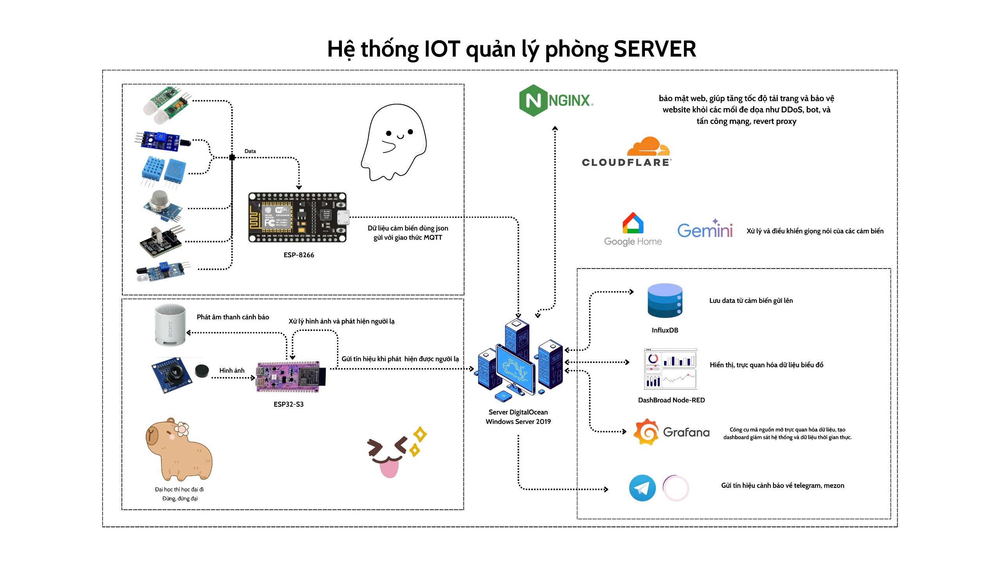
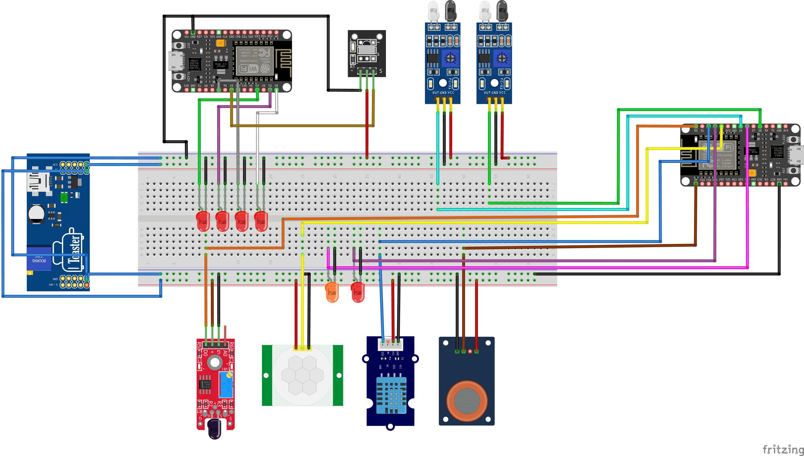

# Smart Home IoT System

## Project Overview
This project is a comprehensive IoT-based smart home system designed to monitor and control various environmental parameters and devices. It integrates multiple sensors, a camera module, and an IR remote control system, leveraging MQTT for communication, Node-RED for data processing, and Grafana for visualization. The system is deployed with a secure HTTPS setup using Nginx as a reverse proxy.

## Features
- **Sensor Monitoring**:
  - PIR motion sensor for detecting movement.
  - Flame sensor for fire detection.
  - IR sensors for sequential detection (e.g., entry/exit tracking).
  - MQ135 gas sensor for air quality monitoring.
  - DHT11 sensor for temperature and humidity.
- **Camera Integration**:
  - ESP32-CAM captures and sends JPEG images via MQTT for remote monitoring.
- **Data Processing and Visualization**:
  - Node-RED processes sensor data and camera images, with a dashboard for user interaction.
  - InfluxDB stores time-series data.
  - Grafana provides real-time dashboards for sensor data visualization.
- **Secure Communication**:
  - Nginx reverse proxy with HTTPS and self-signed certificates.
  - MQTT broker (Mosquitto) for secure device communication.
- **Automated Deployment**:
  - Python script to launch all services (Node-RED, Mosquitto, InfluxDB, Grafana, Nginx).

## System Architecture
The system architecture illustrates how devices communicate through MQTT and how data flows to the backend services for processing and visualization.



```
[ESP8266 Sensors] ---- MQTT ----> [Mosquitto Broker]
[ESP32-CAM]      ---- MQTT ----> [Mosquitto Broker]
[IR Remote]      ---- MQTT ----> [Mosquitto Broker]
                     |
                     v
[Node-RED] <--> [InfluxDB] <--> [Grafana]
   |                ^
   v                |
[Nginx Reverse Proxy] <--> [Internet]
```

## Hardware Components
- **ESP8266 NodeMCU**:
  - Runs `Sensor.ino` for sensor data collection.
  - Connects PIR, flame, IR, MQ135, and DHT11 sensors.
- **ESP32-CAM**:
  - Runs `espcam_send_to_node_red.ino` for image capture and MQTT publishing.
- **ESP8266 with IR**:
  - Runs `control_led_ir_remote_f.ino` for IR-based AC control and LED management.
- **Sensors**:
  - PIR (motion), flame, IR (x2), MQ135 (gas), DHT11 (temperature/humidity).
- **Other**:
  - LEDs, buzzer, IR receiver, and IR LED for AC control.

## Circuit Assembly Guide
This section provides a visual guide to assembling the hardware components. The image below shows the connections for the ESP8266 NodeMCU, sensors, LEDs, buzzer, and IR components.



### Steps:
1. **ESP8266 NodeMCU Connections**:
   - Connect PIR sensor to GPIO2 (D4).
   - Connect flame sensor to GPIO3 (RX).
   - Connect IR sensors to GPIO14 (D5) and GPIO15 (D8).
   - Connect MQ135 analog output to A0.
   - Connect DHT11 data pin to GPIO4 (D2).
   - Connect LEDs to GPIO12 (D6), GPIO0 (D3), GPIO5 (D1), GPIO13 (D7), GPIO16 (D0).
   - Connect buzzer to GPIO13 (D7).
2. **ESP32-CAM**:
   - Ensure the camera module is properly seated and powered.
   - Connect to WiFi as per `espcam_send_to_node_red.ino`.
3. **IR Remote Setup**:
   - Connect IR receiver to GPIO14 (D5).
   - Connect IR LED to GPIO4 (D2) for AC control.
4. **Power Supply**:
   - Use a stable 5V power source for ESP8266 and ESP32-CAM.
   - Ensure sensors and peripherals are powered appropriately (3.3V or 5V as per specs).

## Software Components
- **Arduino Sketches**:
  - `Sensor.ino`: Collects and publishes sensor data to MQTT.
  - `espcam_send_to_node_red.ino`: Captures and sends images via MQTT.
  - `control_led_ir_remote_f.ino`: Handles IR remote commands and LED control.
- **Backend Services**:
  - **Mosquitto**: MQTT broker for device communication.
  - **Node-RED**: Processes data, manages flows, and hosts a dashboard.
  - **InfluxDB**: Stores sensor data for time-series analysis.
  - **Grafana**: Visualizes sensor data and system metrics.
  - **Nginx**: Reverse proxy for secure HTTPS access.
- **Configuration Files**:
  - `config.yml`: Node-RED HTTP bind settings.
  - `nginx.conf`: Nginx configuration for HTTPS and proxying.
  - `run_app.py`: Python script to start all services.
  - `settings.js`: Node-RED settings for HTTPS and authentication.
  - `custom.ini`: Grafana configuration for HTTPS.

## Installation
### Prerequisites
- **Hardware**:
  - ESP8266 NodeMCU, ESP32-CAM, sensors, LEDs, buzzer, IR receiver/transmitter.
- **Software**:
  - Arduino IDE with ESP8266/ESP32 board support.
  - Node-RED, Mosquitto, InfluxDB, Grafana, Nginx installed on a server.
  - Python 3.x for running `run_app.py`.
- **Dependencies**:
  - Arduino libraries: `ESP8266WiFi`, `PubSubClient`, `DHT`, `IRremoteESP8266`, `ArduinoJson`.
  - Node-RED nodes: `node-red-dashboard`, `node-red-contrib-influxdb`.
  - Self-signed SSL certificates for HTTPS.

### Setup Steps
1. **Hardware Setup**:
   - Follow the **Circuit Assembly Guide** to connect components.
   - Ensure stable power supply and WiFi connectivity.

2. **Arduino Configuration**:
   - Open `Sensor.ino`, `espcam_send_to_node_red.ino`, and `control_led_ir_remote_f.ino` in Arduino IDE.
   - Update WiFi credentials (`ssid`, `password`) and MQTT broker details (`mqtt_server`, `mqtt_username`, `mqtt_password`).
   - Flash the sketches to the respective boards.

3. **Server Setup**:
   - Install Mosquitto, InfluxDB, Grafana, Node-RED, and Nginx on your server.
   - Place SSL certificates (`node-red.cert`, `node-red.key`) in `C:\Users\Administrator\.node-red`.
   - Configure `nginx.conf` with the correct paths and domain (`ateamiuh.me`).
   - Update `settings.js` and `custom.ini` with SSL certificate paths and authentication details.

4. **Node-RED Configuration**:
   - Import flows into Node-RED to process MQTT data, store in InfluxDB, and create a dashboard.
   - Ensure `config.yml` points to the correct HTTP bind port (8086).

5. **Run Services**:
   - Execute `run_app.py` to start Mosquitto, InfluxDB, Grafana, Node-RED, and Nginx.
   ```bash
   python run_app.py
   ```

6. **Access the System**:
   - Node-RED Editor: `https://ateamiuh.me/nodered/`
   - Node-RED Dashboard: `https://ateamiuh.me/ui/`
   - Grafana: `https://ateamiuh.me:3000`
   - Login with credentials defined in `settings.js` (Node-RED) and `custom.ini` (Grafana).

## Usage
- **Sensor Monitoring**:
  - Sensors publish data to MQTT topics (`data_xyz`).
  - View real-time temperature, humidity, gas levels, motion, and flame status on the Node-RED dashboard or Grafana.
- **Camera**:
  - ESP32-CAM sends images to `esp32cam/image` topic, viewable in Node-RED.
- **IR Control**:
  - Use an IR remote to adjust AC temperature (codes: `0xB55C4E88` for increase, `0x198AF72C` for decrease).
  - Control LEDs via MQTT topic `led/control` with JSON payloads (e.g., `{"led1": true}`).
- **Alerts**:
  - Motion or fire detection triggers LEDs and buzzer.
  - Sequential IR detection logs entry/exit events.

## Security
- **HTTPS**: All services are accessed via HTTPS with self-signed certificates.
- **Authentication**: Node-RED and Grafana require credentials.
- **MQTT**: Secured with username/password authentication.
- **Nginx**: Enforces HSTS and secure ciphers.

## Troubleshooting
- **WiFi/MQTT Connection Issues**:
  - Verify credentials in Arduino sketches.
  - Check Mosquitto logs for connection errors.
- **Node-RED/Grafana Access**:
  - Ensure Nginx is running and certificates are valid.
  - Check `settings.js` and `custom.ini` for correct paths.
- **Sensor Data**:
  - Confirm sensor wiring as per the **Circuit Assembly Guide**.
  - Monitor Serial output for debugging.

## Future Improvements
- Add support for additional sensors (e.g., CO2, light).
- Implement mobile app integration for remote control.
- Enhance security with Let's Encrypt certificates.
- Add machine learning for anomaly detection in sensor data.

## License
This project is licensed under the MIT License.

## Contributors
- [Your Name] - Project Lead and Developer